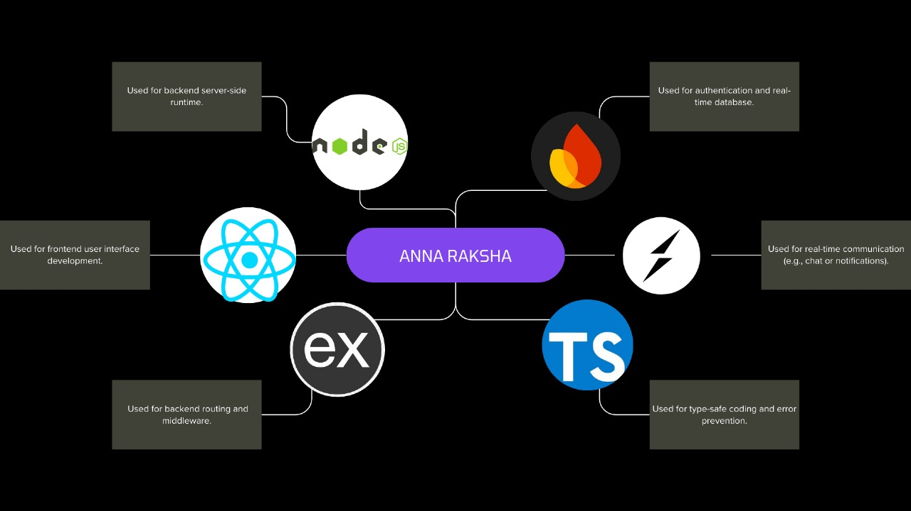
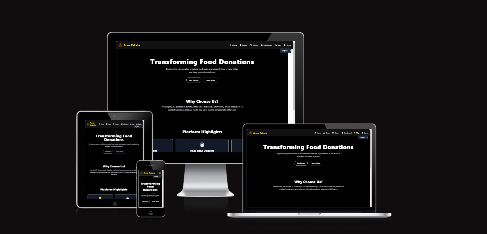

## Watch the Demo Video 🎥

You can watch the demo video by clicking the link below:

[Watch Demo Video](demo video.mp4)


Replace `YOUR_VIDEO_ID` with the ID of your YouTube video. You can find the video ID in the YouTube URL after `v=`.

##Food Donation and Request System

  <!-- Replace with your actual project image URL -->

## Project Overview

This is a full-stack web application built to facilitate food donation and requests. The app allows users to post food they want to donate, as well as request food. Users can sign in via Firebase Authentication, and their data is stored in Firestore. The application is designed with an easy-to-use interface, utilizing modern web technologies to provide a seamless experience.

### Features:
- **User Authentication** using Firebase Auth 🛂
- **Post a Food Request** 🍽️: Users can request food with details like quantity, food type, pickup location, and instructions.
- **Post Food Donation** 🍔: Users can donate food with details like the name of the food, quantity, and pickup location.
- **Real-Time Updates** 📡: The app uses Socket.IO to provide real-time updates for food donations and requests.
- **Dashboard** 📊: A dedicated page for users to view their donation history and requests.
- **Profile Management** 👤: Users can manage their profile and view their posted content.

---

## Project Link 🚀
https://anna-raksha-bmu9.vercel.app/


## Tech Stack 🚀

The following technologies were used to build this project:

- **Frontend**:
  - : For building the user interface.
  - : A fast build tool for modern web projects.
  - : For utility-first CSS styling, making the UI highly customizable.
  - : For type-safe development, enhancing the maintainability and scalability of the code.
  - : For real-time communication between users (for updates on donations and requests).
  - : For managing routing in the app.

- **Backend**:
  - : Server-side runtime environment.
  - : Web framework for Node.js to handle routing and HTTP requests.
  - : Firebase for authentication and Firestore database.
    - : For handling user authentication and authorization.
    - : A NoSQL database for storing user data and posts.
  - : For implementing real-time bidirectional communication.

---

---
 
## Installation 🛠️

To run this project locally, follow the steps below:

### Prerequisites 🖥️

- Node.js installed on your machine.
- Firebase account (for Firebase Authentication and Firestore setup).
- A modern browser (Chrome, Firefox, etc.).

### Steps 🔄

1. **Clone the repository:**

   ```bash
   git clone https://github.com/Hari-hara7/anna-raksha.git


## Firebase Setup 🔑

### Firebase Authentication 🛂:
- Enable **Email/Password Authentication** or use any other authentication method.

### Firestore 📚:
- Create two collections in Firestore:
  - **foodPosts**: For storing donated food details.
  - **foodRequests**: For storing food request details.
  
- The documents in these collections will contain information like food name, quantity, pickup location, and user details (email, name, etc.).

---

## Built-in Icons 🖼️

The app uses [Font Awesome](https://fontawesome.com/) icons for displaying various actions like adding posts, editing, deleting, and more. You can easily replace them or add new ones as needed.

### Example icons:

- **Add Post** ➕
- **Edit** ✏️
- **Delete** ❌

You can refer to the full icon library here: [Font Awesome Icons](https://fontawesome.com/icons).

---

## Contributing 🤝

We welcome contributions! If you'd like to contribute to the project, feel free to:

1. **Fork the repository.**
2. **Create a new branch** (`git checkout -b feature/your-feature-name`).
3. **Make your changes and commit them** (`git commit -am 'Add your feature'`).
4. **Push to the branch** (`git push origin feature/your-feature-name`).
5. **Create a new Pull Request**.

---

## License 📝

This project is licensed under the **MIT License** - see the [LICENSE](LICENSE) file for details.

---

## Links 🔗

- [GitHub Repository](https://github.com/your-username/food-donation-app)
- [Live Demo](https://your-live-demo-url.com)

---

### Notes:
- Be sure to replace the placeholder **GitHub** links, Firebase setup, and demo URL with your actual repository and project details.
- Use the appropriate icon sizes and styles based on your preference (you can also adjust icon sizes or styling using CSS classes).


