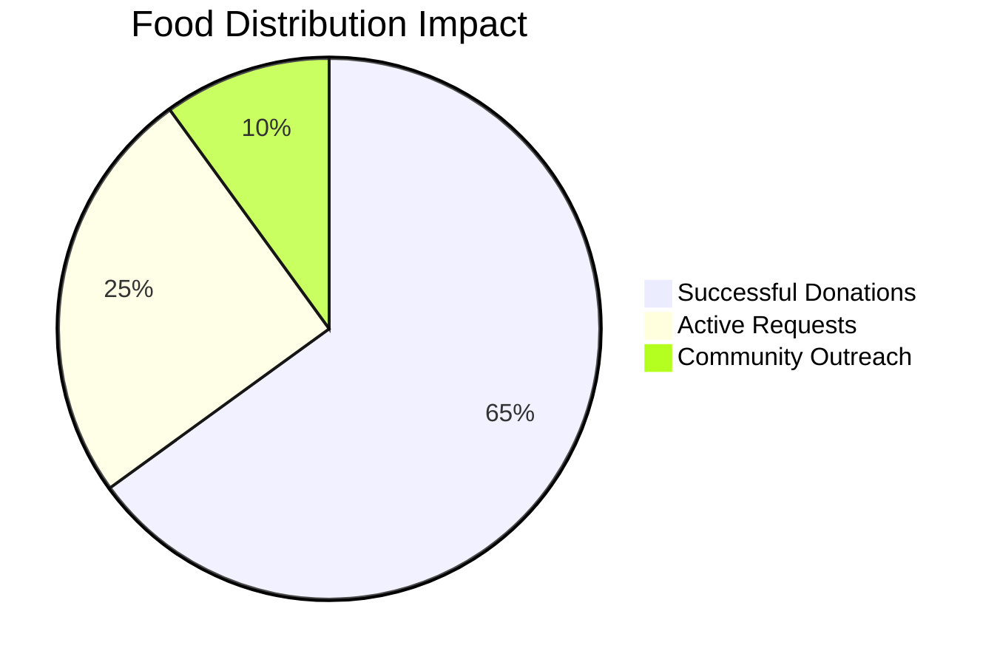
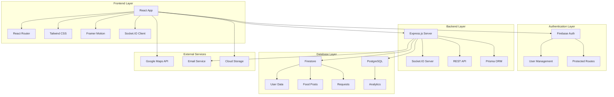
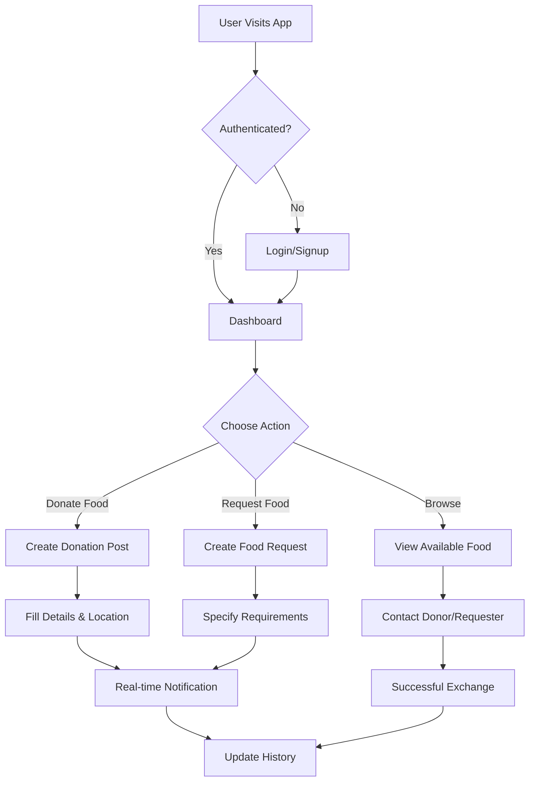

<div align="center">

# 🍽️ Anna Raksha
### *Nourishing Communities, One Meal at a Time*

[](https://anna-raksha-bmu9.vercel.app/)
[](https://github.com/Hari-hara7/anna-raksha/blob/main/anna-raksha/src/assets/video.mp4)


[](https://github.com/Hari-hara7/anna-raksha/stargazers)
[](https://github.com/Hari-hara7/anna-raksha/network)
[](https://github.com/Hari-hara7/anna-raksha/issues)
[](LICENSE)
[](https://github.com/Hari-hara7/anna-raksha/commits)

</div>

---

## 📋 Table of Contents

- [About](#-about)
- [Features](#-features)
- [Live Demo & Preview](#-live-demo--preview)
- [System Architecture](#-system-architecture)
- [Tech Stack](#-tech-stack)
- [Screenshots](#-screenshots)
- [Installation](#-installation)
- [Usage](#-usage)
- [API Documentation](#-api-documentation)
- [Contributing](#-contributing)
- [License](#-license)
- [Acknowledgments](#-acknowledgments)

---

## 🎯 About

**Anna Raksha** (Food Guardian) is a comprehensive full-stack web application designed to bridge the gap between food surplus and food scarcity. Our platform enables seamless food donation and request management, fostering community collaboration to reduce food waste while helping those in need.

> **Mission**: To create a sustainable ecosystem where excess food finds its way to those who need it most, one donation at a time.

### 🌟 Impact Metrics



---

## ✨ Features

<div align="center">

| 🔐 **Authentication** | 🍽️ **Food Management** | 📱 **Real-time Updates** | 🗺️ **Location Services** |
|:---:|:---:|:---:|:---:|
| Secure Firebase Auth | Post Donations & Requests | Socket.IO Integration | Interactive Maps |
| User Profile Management | Detailed Food Listings | Live Notifications | Pickup Location Tracking |

</div>

### 🚀 Core Features

- **🔐 Secure Authentication**: Firebase-powered user authentication with profile management
- **🍔 Food Donation Posts**: Create detailed listings with quantity, type, and pickup information
- **🍽️ Food Request System**: Submit requests with specific requirements and location details
- **📊 Personal Dashboard**: Track donation history, requests, and community impact
- **🔔 Real-time Notifications**: Instant updates via Socket.IO for new donations and requests
- **🗺️ Interactive Maps**: Google Maps integration for location visualization
- **🤖 AI Chatbot**: Intelligent assistance for users navigating the platform
- **📱 Responsive Design**: Seamless experience across all devices
- **🌐 Internationalization**: Multi-language support for global accessibility
- **📈 Analytics Dashboard**: Comprehensive insights into food distribution patterns

### 🎨 User Experience Features

- **🎭 Framer Motion Animations**: Smooth, engaging user interactions
- **🎨 Modern UI/UX**: Clean, intuitive interface with Tailwind CSS
- **♿ Accessibility**: WCAG compliant design for inclusive access
- **⚡ Performance Optimized**: Fast loading with Vite build optimization

---

## 🎬 Live Demo & Preview

<div align="center">

### 🌐 [**Visit Live Application**](https://anna-raksha-bmu9.vercel.app/)

[](https://anna-raksha-bmu9.vercel.app/)

### 🎥 Demo Video
[**Watch Full Demo Video**](https://github.com/Hari-hara7/anna-raksha/blob/main/anna-raksha/src/assets/video.mp4)

</div>

---

## 🏗️ System Architecture



### 🔄 User Flow Diagram



---

## 🛠️ Tech Stack

<div align="center">


</div>

### 🎨 Frontend Technologies

<div align="center">

| Technology | Purpose | Badge |
|:---:|:---:|:---:|
| **React 18** | UI Framework |  |
| **TypeScript** | Type Safety |  |
| **Vite** | Build Tool |  |
| **Tailwind CSS** | Styling |  |
| **Framer Motion** | Animations |  |

</div>

### ⚙️ Backend Technologies

<div align="center">

| Technology | Purpose | Badge |
|:---:|:---:|:---:|
| **Node.js** | Runtime |  |
| **Express.js** | Web Framework |  |
| **Socket.IO** | Real-time Communication |  |
| **Prisma** | Database ORM |  |

</div>

### 🗄️ Database & Services

<div align="center">

| Service | Purpose | Badge |
|:---:|:---:|:---:|
| **Firebase** | Authentication & Database |  |
| **Google Maps** | Location Services |  |
| **Vercel** | Deployment |  |

</div>

### 📊 Development Tools

<div align="center">

| Tool | Purpose | Badge |
|:---:|:---:|:---:|
| **ESLint** | Code Linting |  |
| **PostCSS** | CSS Processing |  |
| **Git** | Version Control |  |

</div>

---

## 📸 Screenshots

<div align="center">

### 🏠 Homepage
*Welcome to Anna Raksha - Your gateway to community food sharing*

### 📊 Dashboard
*Comprehensive overview of your donations, requests, and community impact*

### 🍽️ Food Listings
*Browse available food donations with detailed information and location*

### 🗺️ Interactive Map
*Visualize food availability and pickup locations in your area*

</div>

---

## 🚀 Installation

### 📋 Prerequisites

Before you begin, ensure you have the following installed:

- **Node.js** (v16.0.0 or higher)
- **npm** or **yarn** package manager
- **Git** for version control
- **Firebase** account for authentication and database

### 🔧 Setup Instructions

1. **Clone the Repository**
   ```bash
   git clone https://github.com/Hari-hara7/anna-raksha.git
   cd anna-raksha
   ```

2. **Install Frontend Dependencies**
   ```bash
   cd anna-raksha
   npm install
   ```

3. **Install Backend Dependencies**
   ```bash
   cd ../backend
   npm install
   ```

4. **Environment Configuration**
   
   Create `.env` files in both frontend and backend directories:
   
   **Frontend (.env)**
   ```env
   VITE_FIREBASE_API_KEY=your_firebase_api_key
   VITE_FIREBASE_AUTH_DOMAIN=your_firebase_auth_domain
   VITE_FIREBASE_PROJECT_ID=your_firebase_project_id
   VITE_FIREBASE_STORAGE_BUCKET=your_firebase_storage_bucket
   VITE_FIREBASE_MESSAGING_SENDER_ID=your_firebase_messaging_sender_id
   VITE_FIREBASE_APP_ID=your_firebase_app_id
   VITE_GOOGLE_MAPS_API_KEY=your_google_maps_api_key
   ```
   
   **Backend (.env)**
   ```env
   DATABASE_URL=your_database_url
   FIREBASE_SERVICE_ACCOUNT_KEY=path_to_service_account_key
   PORT=5000
   ```

5. **Firebase Setup**
   - Create a new Firebase project
   - Enable Authentication (Email/Password)
   - Create Firestore database
   - Add your web app configuration to the frontend `.env`

6. **Database Setup**
   ```bash
   cd backend
   npx prisma generate
   npx prisma db push
   ```

7. **Start Development Servers**
   
   **Frontend**
   ```bash
   cd anna-raksha
   npm run dev
   ```
   
   **Backend**
   ```bash
   cd backend
   npm run dev
   ```

8. **Access the Application**
   - Frontend: `http://localhost:5173`
   - Backend API: `http://localhost:5000`

---

## 📖 Usage

### 👤 User Registration & Authentication

1. **Sign Up**: Create a new account with email and password
2. **Login**: Access your account securely
3. **Profile Setup**: Complete your profile with contact information

### 🍔 Food Donation Process

1. **Create Donation**: Navigate to "Donate Food" section
2. **Fill Details**: Add food type, quantity, expiry date, and pickup location
3. **Post Listing**: Share your donation with the community
4. **Manage Donations**: Track and update your active donations

### 🍽️ Food Request Process

1. **Create Request**: Navigate to "Request Food" section
2. **Specify Requirements**: Detail your food needs and preferences
3. **Set Location**: Add your pickup/delivery location
4. **Track Requests**: Monitor responses to your requests

### 📊 Dashboard Features

- **Overview**: Summary of your activity and community impact
- **History**: Complete record of past donations and requests
- **Notifications**: Real-time updates on food availability
- **Analytics**: Personal contribution statistics

---

## 📡 API Documentation

### 🔗 Base URL
```
https://anna-raksha-api.vercel.app/api
```

### 🔐 Authentication Endpoints

| Method | Endpoint | Description |
|:---:|:---:|:---:|
| `POST` | `/auth/register` | Register new user |
| `POST` | `/auth/login` | User login |
| `POST` | `/auth/logout` | User logout |
| `GET` | `/auth/profile` | Get user profile |

### 🍽️ Food Management Endpoints

| Method | Endpoint | Description |
|:---:|:---:|:---:|
| `GET` | `/food/donations` | Get all food donations |
| `POST` | `/food/donations` | Create new donation |
| `GET` | `/food/requests` | Get all food requests |
| `POST` | `/food/requests` | Create new request |
| `DELETE` | `/food/donations/:id` | Delete donation |

### 📊 Analytics Endpoints

| Method | Endpoint | Description |
|:---:|:---:|:---:|
| `GET` | `/analytics/user-stats` | Get user statistics |
| `GET` | `/analytics/community-impact` | Get community metrics |

---

## 🤝 Contributing

We welcome contributions from the community! Here's how you can help:

### 🌟 Ways to Contribute

- 🐛 **Bug Reports**: Found a bug? Report it!
- 💡 **Feature Requests**: Have an idea? Share it!
- 🔧 **Code Contributions**: Submit pull requests
- 📚 **Documentation**: Improve our docs
- 🎨 **Design**: Enhance UI/UX
- 🌐 **Translations**: Help us go global

### 📝 Development Workflow

1. **Fork the Repository**
   ```bash
   git fork https://github.com/Hari-hara7/anna-raksha.git
   ```

2. **Create Feature Branch**
   ```bash
   git checkout -b feature/amazing-feature
   ```

3. **Make Changes**
   - Follow coding standards
   - Add tests for new features
   - Update documentation

4. **Commit Changes**
   ```bash
   git commit -m "Add amazing feature"
   ```

5. **Push to Branch**
   ```bash
   git push origin feature/amazing-feature
   ```

6. **Open Pull Request**
   - Provide clear description
   - Link related issues
   - Add screenshots if UI changes

### 📋 Contribution Guidelines

- **Code Style**: Follow ESLint configuration
- **Testing**: Maintain test coverage above 80%
- **Documentation**: Update relevant docs
- **Commits**: Use conventional commit messages
- **Reviews**: All PRs require review approval

### 🏆 Contributors

Thanks to all the amazing contributors who have helped make Anna Raksha better!

[](https://github.com/Hari-hara7/anna-raksha/graphs/contributors)

---

## 📄 License

This project is licensed under the **MIT License** - see the [LICENSE](LICENSE) file for details.

```
MIT License

Copyright (c) 2024 Anna Raksha

Permission is hereby granted, free of charge, to any person obtaining a copy
of this software and associated documentation files (the "Software"), to deal
in the Software without restriction, including without limitation the rights
to use, copy, modify, merge, publish, distribute, sublicense, and/or sell
copies of the Software, and to permit persons to whom the Software is
furnished to do so, subject to the following conditions:

The above copyright notice and this permission notice shall be included in all
copies or substantial portions of the Software.
```

---

## 🙏 Acknowledgments

### 🎯 Special Thanks

- **Firebase Team** for providing excellent authentication and database services
- **React Community** for the amazing ecosystem and libraries
- **Tailwind CSS** for making styling effortless and beautiful
- **Vercel** for seamless deployment and hosting
- **Open Source Community** for inspiration and support

### 🌟 Inspiration

Anna Raksha was inspired by the UN Sustainable Development Goals, particularly:
- **Goal 2**: Zero Hunger
- **Goal 11**: Sustainable Cities and Communities
- **Goal 12**: Responsible Consumption and Production

### 📞 Contact & Support

<div align="center">

[](https://github.com/Hari-hara7)
[](https://linkedin.com/in/hari-hara7)
[](mailto:contact@annaraksha.com)

**Project Link**: [https://github.com/Hari-hara7/anna-raksha](https://github.com/Hari-hara7/anna-raksha)

**Live Demo**: [https://anna-raksha-bmu9.vercel.app/](https://anna-raksha-bmu9.vercel.app/)

</div>

---

<div align="center">

### 🌟 Star this repository if you found it helpful!

[](https://star-history.com/#Hari-hara7/anna-raksha&Date)

**Made with ❤️ for the community**

*Together, we can build a world where no one goes hungry.*

</div>